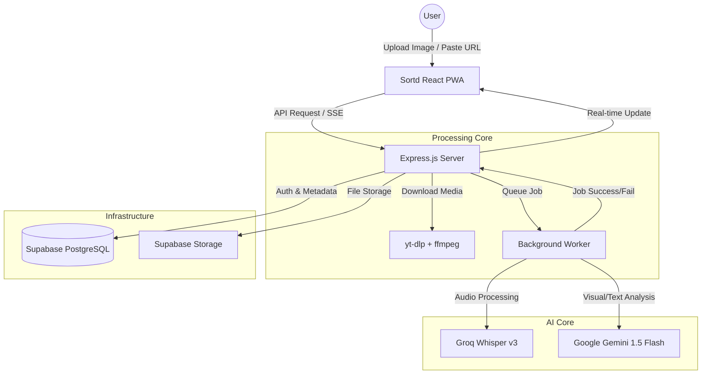

# Sortd — AI Content Capture Platform
### HACKDATA V1 Hackathon Submission

**Team Name:** MadGroot  
**Team Lead:** Muhammad Ismail

---

## 📖 Overview
**Sortd** is an innovation-driven content capture platform designed to bridge the "Capture Gap." In a world where digital inspiration is scattered across Instagram Reels, YouTube videos, and screenshots, Sortd provides a unified, AI-powered system to automatically extract, summarize, and categorize your digital universe.

### ⚠️ Problem Statement
Digital content consumption is fragmented. Users "Save" or "Bookmark" content across dozens of platforms, only for that information to be lost in a digital graveyard. Manually organizing these links or screenshots is time-consuming. Sortd automates this entire lifecycle, transforming raw links and images into organized, searchable, and actionable knowledge.

---

## 🛠️ System Design
Below is the architectural blueprint of the Sortd ecosystem, showcasing the vertical flow from user input to AI-driven organization.



---

## 🧠 AI Integration
Sortd leverages a sophisticated synergy between multimodal vision and high-fidelity audio transcription to provide a zero-effort organization experience:

1.  **Multimodal Vision (Google Gemini 1.5 Flash):** When a user uploads a screenshot, the system uses Gemini's vision capabilities to "see" the content. It is specifically tuned to ignore app UI elements (usernames, buttons, likes) and focus entirely on the core information—whether it's a quote, a recipe, or a job opportunity. It extracts text in multiple languages, including English, Urdu, and Arabic, preserving the original intent.
2.  **Audio Intelligence (Groq Whisper v3):** For video links (YouTube/Instagram), Sortd extracts the audio and utilizes Groq’s ultra-fast Whisper implementation to generate high-accuracy transcripts.
3.  **Autonomous Categorization:** The extracted text is then analyzed by Gemini to determine the best-fit list (e.g., "Learn", "Recipes", "Deals"). It generates a concise, catchy title and a structured Markdown summary, ensuring that every "clip" is immediately useful without manual editing.

---

## 🚀 Key Features
- **URL Capture:** One-click capture for Instagram, YouTube, and more.
- **Screenshot OCR:** Intelligent extraction from images using Gemini Vision.
- **Real-time Updates:** Processing status tracked via Server-Sent Events (SSE).
- **PWA Ready:** Installable on Android/iOS with Share Target support.
- **Smart Lists:** Automatic sorting into categories with custom emojis and colors.

---

## 💻 Tech Stack
- **Frontend:** React, Vite, Tailwind CSS, Lucide Icons.
- **Backend:** Node.js, Express, Multer, Express-Rate-Limit.
- **Database/Auth:** Supabase (PostgreSQL & GoTrue).
- **AI Models:** Google Gemini 1.5 Flash, Groq Whisper (whisper-large-v3).
- **Tooling:** yt-dlp, ffmpeg (for media processing).

---

## ⚙️ Setup & Installation

### 1. Environment Configuration
Create a `.env` file in the `server/` directory:
```env
SUPABASE_URL=your_supabase_url
SUPABASE_SERVICE_ROLE_KEY=your_supabase_key
GEMINI_API_KEY=your_gemini_key
GROQ_API_KEY=your_groq_key
PORT=3001
```

### 2. Installation
```bash
# Install dependencies for both client and server
npm run install-all

# Start the development environment
npm run dev
```

### 3. Database
Execute the schema provided in `schema.sql` within your Supabase SQL editor to initialize tables and RLS policies.

---

## 🌐 Deployment
- **Frontend:** Deployed on **Vercel**.
- **Backend:** Deployed on **Railway.app** (supports necessary binaries like `yt-dlp` and `ffmpeg`).
- **Database:** Hosted on **Supabase**.

---
Built with ❤️ for **HACKDATA V1** by Team **MadGroot**.
