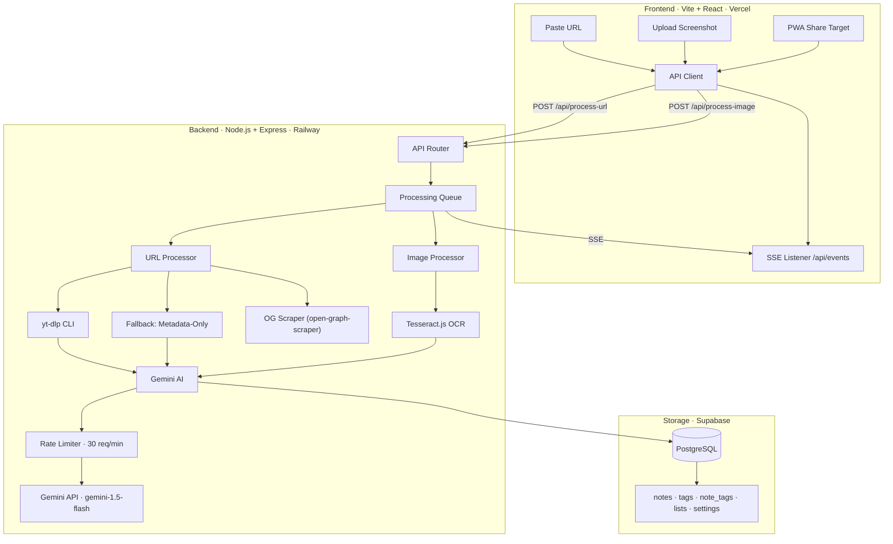

# Architecture

Sortd is a mobile-first content capture tool deployed on Railway (backend) and Vercel (frontend). It uses Gemini AI to turn reels, videos, and screenshots into organized, searchable notes.

---

## System Diagram



---

## Tech Stack

| Layer | Technology | Version | Why |
|-------|-----------|---------|-----|
| **Frontend** | Vite + React | Vite 6.x, React 19.x | Fast HMR, no config |
| **Backend** | Node.js + Express | Express 5.1 | ESM-only (`"type": "module"`), async routes |
| **Video Download** | yt-dlp (system CLI) | Latest | Audio extraction from reels/shorts |
| **Transcription** | Gemini multimodal API | gemini-1.5-flash | Audio → transcript + summary in one call |
| **OCR** | Tesseract.js | 5.1.x | Server-side screenshot text extraction |
| **AI** | Gemini API (free tier) | gemini-1.5-flash | Summarize, categorize, tag |
| **Folder Watch** | Chokidar | 4.x | ESM-only FS event watcher |
| **Database** | Supabase (PostgreSQL) | — | Deployed, managed Postgres |
| **OG Scraper** | open-graph-scraper | 6.8.x | Extract title/desc/thumbnail from URLs |
| **File Uploads** | Multer | 2.0.0 | Multipart form handling |
| **Queue** | Custom in-memory | — | Rate-limit Gemini, prevent thundering herd |

### System Dependencies (not npm)

| Dep | Install | Required |
|-----|---------|----------|
| **yt-dlp** | `pip install yt-dlp` or `brew install yt-dlp` | Yes (falls back to metadata-only without it) |
| **ffmpeg** | `apt install ffmpeg` or `brew install ffmpeg` | Yes — yt-dlp needs it for audio conversion |
| **Node.js** | v20+ | Yes |

---

## Known Constraints

| Constraint | Rationale |
|-----------|-----------|
| No authentication | Private deployment. Protected by Supabase RLS if shared. |
| Gemini free tier: ~1000 req/day | Rate limiting supports ~300-500 captures/day. |
| yt-dlp breaks periodically | Instagram breaks often. Metadata-only fallback must always work. |
| 25MB audio file limit | Gemini inline data ceiling. |

---

## API Endpoints

### Notes

| Method | Path | Query/Body | Returns | Status |
|--------|------|-----------|---------|--------|
| `GET` | `/api/notes` | `?list_id=&starred=true&search=&tag=&limit=50&offset=0` | `Note[]` | 200 |
| `GET` | `/api/notes/:id` | — | `Note` | 200/404 |
| `POST` | `/api/notes` | `{ title, content?, source_type: 'manual', tags?: string[], list_id? }` | `Note` | 201 |
| `PATCH` | `/api/notes/:id` | `{ title?, content?, list_id?, tags?: string[], starred? }` | `Note` | 200/404 |
| `DELETE` | `/api/notes/:id` | — | `{ success: true }` | 200 |

> **`tags` semantics:** `tags` is a **full replacement** array of tag name strings (e.g. `["recipe", "healthy"]`). Not a diff. Not tag IDs. Passing `tags` deletes all existing tags on the note and replaces them with the provided names.

### Lists

| Method | Path | Body | Returns | Status |
|--------|------|------|---------|--------|
| `GET` | `/api/lists` | — | `List[]` (with `note_count`) | 200 |
| `POST` | `/api/lists` | `{ name, emoji?, color? }` | `List` | 201 |
| `PATCH` | `/api/lists/:id` | `{ name?, emoji?, color?, sort_order? }` | `List` | 200/404 |
| `DELETE` | `/api/lists/:id` | — | `{ success: true }` | 200/400 |

Deleting a list moves its notes to Inbox before deletion. Default lists cannot be deleted — attempting to delete one returns:

```
400 Bad Request
{ "error": "Cannot delete default list", "code": "DEFAULT_LIST_PROTECTED" }
```

### Processing

| Method | Path | Body | Returns | Status |
|--------|------|------|---------|--------|
| `POST` | `/api/process-url` | `{ url }` | `{ jobId }` | 202 |
| `POST` | `/api/process-image` | multipart `image` field | `{ jobId }` | 202 |

Both return immediately. Client listens on SSE for completion.

### Queue

| Method | Path | Returns |
|--------|------|---------|
| `GET` | `/api/queue/stats` | `{ pending, processing, done, failed, dailyApiCalls, rateLimitRemaining, deadLetterCount }` |

### Folder Watch (Desktop Only)

Folder watching is supported for local development or desktop deployments. In the cloud (Railway), it is disabled as the server has no persistent filesystem to watch.

| Method | Path | Body | Returns |
|--------|------|------|---------|
| `GET` | `/api/folder-watch` | — | `{ watching, path, supported: boolean }` |
| `POST` | `/api/folder-watch/start` | `{ path }` | `{ watching: true, path }` | 
| `POST` | `/api/folder-watch/stop` | — | `{ watching: false, path: null }` |

`POST /api/folder-watch/start` validates the path before starting:

```
400 { "error": "Path does not exist", "code": "INVALID_PATH" }
400 { "error": "Path is not a directory", "code": "NOT_A_DIRECTORY" }
```

Validation uses `fs.existsSync(path)` and `fs.statSync(path).isDirectory()`.

### Settings

| Method | Path | Body | Returns |
|--------|------|------|---------|
| `GET` | `/api/settings` | — | `{ geminiKeySet, watchStatus, queueStats }` |
| `POST` | `/api/settings/gemini-key` | `{ key }` | `{ success: true }` |

### SSE

| Method | Path | Description |
|--------|------|-------------|
| `GET` | `/api/events` | Persistent SSE stream for real-time updates |

---

## SSE Event Specification

### Connection

```javascript
const es = new EventSource('http://localhost:3001/api/events');
es.addEventListener('job_queued', (e) => JSON.parse(e.data));
es.addEventListener('job_started', (e) => JSON.parse(e.data));
es.addEventListener('job_done', (e) => JSON.parse(e.data));
es.addEventListener('job_failed', (e) => JSON.parse(e.data));
es.addEventListener('watch_status', (e) => JSON.parse(e.data));
```

### Event Payloads

**`connected`** — sent on handshake:
```json
{ "serverTime": "2026-04-23T10:00:00.000Z" }
```

`serverTime` lets the client detect clock drift between frontend and backend timestamps.

**`job_queued`** — new job enters queue:
```json
{
  "jobId": "uuid",
  "type": "url | image",
  "source": "api | folder_watch",
  "label": "instagram reel | screenshot.png",
  "position": 3,
  "timestamp": "ISO-8601"
}
```

**`job_started`** — queue picks up a job (fires multiple times as steps progress):
```json
{
  "jobId": "uuid",
  "type": "url | image",
  "step": "downloading | extracting | transcribing | categorizing | ocr",
  "timestamp": "ISO-8601"
}
```

**`job_done`** — job succeeded:
```json
{
  "jobId": "uuid",
  "note": { "id": "...", "title": "...", "list_id": "...", "tags": [...], ... },
  "processingTimeMs": 4200,
  "timestamp": "ISO-8601"
}
```

**`job_failed`** — job failed after retries:
```json
{
  "jobId": "uuid",
  "type": "url | image",
  "error": "yt-dlp: platform blocked",
  "errorCode": "PLATFORM_BLOCKED | RATE_LIMITED | FILE_TOO_LARGE | YTDLP_NOT_INSTALLED | NETWORK_TIMEOUT | GEMINI_ERROR | OCR_FAILED | UNKNOWN",
  "fallbackUsed": true,
  "fallbackNote": { "id": "...", ... } | null,
  "timestamp": "ISO-8601"
}
```

When `fallbackUsed=true`, a note was still created from metadata only.

**`watch_status`** — folder watch state changed:
```json
{ "watching": true, "path": "/home/user/Screenshots" }
```

### Reconnection

Browser `EventSource` auto-reconnects with ~3s delay. On reconnect, the client must re-fetch state to catch up on events missed during the disconnect:

1. `GET /api/notes?limit=20` — re-hydrate the Inbox with recent notes (catches any `job_done` events that were missed)
2. `GET /api/queue/stats` — update queue status counts

Queue stats alone are insufficient — they only report counts (`pending: 2`), not which specific notes were created. The notes re-fetch is what actually syncs the UI.

---

## OG Metadata Scraper

**Library:** `open-graph-scraper` v6.8.x

| OG Field | Fallback | Maps To |
|----------|----------|---------|
| `og:title` | `twitter:title` → `<title>` → URL hostname | `note.title` |
| `og:description` | `twitter:description` → `<meta description>` → `""` | `note.raw_text` (fallback for Gemini) |
| `og:image` | `twitter:image` → `null` | `note.thumbnail` |
| `og:site_name` | URL hostname | Display only |

When OG tags are completely missing: title = URL hostname, description = empty, thumbnail = empty. The note still gets created — Gemini categorizes whatever text is available. `source_platform` is detected from URL pattern matching, independent of OG data.

```javascript
const { result } = await ogs({ url, timeout: 10000 });
```

---

## API Key Storage

**Decision: Supabase `settings` table. The server loads the key on startup or on-demand.**

Since Railway has an ephemeral filesystem, writing to `.env` is not possible. Instead, a `settings` table in Supabase stores the `gemini_api_key`.

```sql
CREATE TABLE IF NOT EXISTS settings (
  key   TEXT PRIMARY KEY,
  value TEXT
);
```

The Settings UI can update it via `POST /api/settings/gemini-key`, which:
1. Updates the `settings` table in Supabase.
2. Updates the in-memory cache on the server.

The Settings page shows whether a key is configured (`geminiKeySet: boolean`) but **never** exposes the actual key value to the frontend.

---

## Directory Structure

```
sortd/
├── DESIGN.md
├── docs/
│   ├── ARCHITECTURE.md  ← this file
│   ├── PIPELINE.md
│   ├── DATABASE.md
│   ├── QUEUE.md
│   ├── FRONTEND.md
│   └── HACKATHON.md
├── server/
│   ├── .env              (gitignored)
│   ├── index.js
│   ├── package.json
│   ├── sortd.db          (gitignored)
│   ├── temp/             (auto-cleaned: orphans >1hr deleted on startup + every 30min)
│   ├── uploads/          (deleted after processing — even on failure. Errors are logged, not files.)
│   └── services/
│       ├── database.js
│       ├── gemini.js
│       ├── videoProcessor.js
│       ├── imageProcessor.js
│       ├── folderWatcher.js
│       ├── queue.js
│       ├── tempFiles.js
└── client/
    ├── index.html
    ├── vite.config.js
    └── src/
        ├── main.jsx, App.jsx, App.css
        ├── index.css      (design tokens)
        ├── api.js
        ├── components/
        │   ├── BottomNav.jsx
        │   ├── NoteCard.jsx
        │   ├── ListCard.jsx
        │   ├── TagPill.jsx
        │   ├── UploadZone.jsx
        │   ├── ProcessingOverlay.jsx
        │   └── QueueStatus.jsx
        └── pages/
            ├── Inbox.jsx
            ├── Lists.jsx
            ├── ListView.jsx
            ├── AddContent.jsx
            ├── NoteDetail.jsx
            └── Settings.jsx
```
