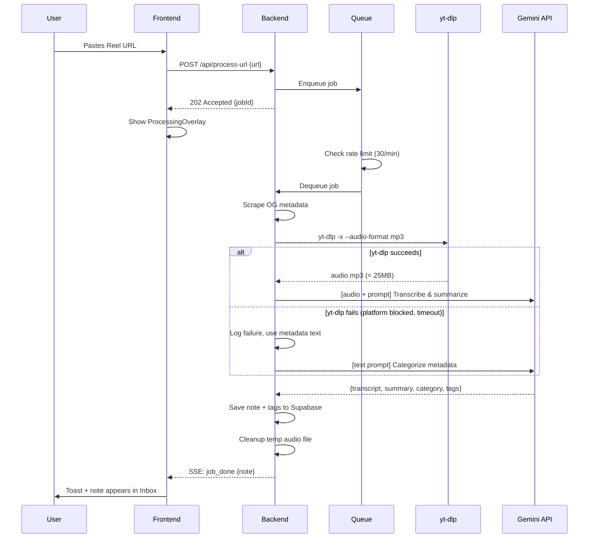
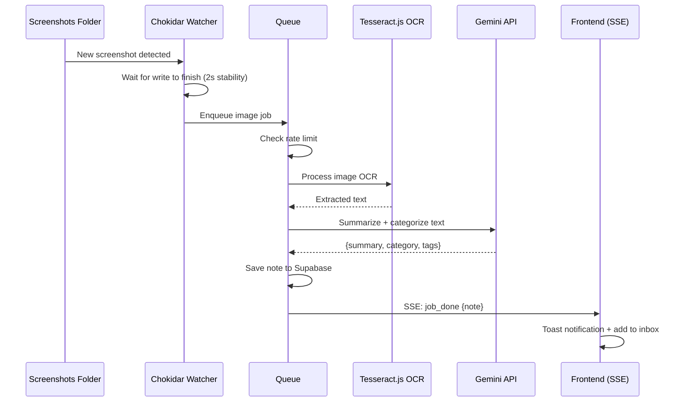

# Pipeline

All content processing flows in Sortd. Three input types → one output type (a Note in Supabase).

---

## Input Types

| Type | Entry Point | Processing Path |
|------|------------|----------------|
| **URL** (reel/video) | `POST /api/process-url` | OG scrape → yt-dlp audio → Gemini transcribe+summarize |
| **Screenshot** (upload) | `POST /api/process-image` | Tesseract OCR → Gemini summarize+categorize |
| **Folder watch** (local only) | Chokidar `add` event | Same as screenshot, enqueued automatically |

All three paths go through the **processing queue** before hitting Gemini. See QUEUE.md for queue details.

---

## Video/URL Pipeline

### Flow



### Steps in Detail

#### 1. Platform Detection

```javascript
function detectPlatform(url) {
  const u = url.toLowerCase();
  if (u.includes('instagram.com') || u.includes('instagr.am')) return 'instagram';
  if (u.includes('youtube.com') || u.includes('youtu.be'))     return 'youtube';
  if (u.includes('tiktok.com'))                                 return 'tiktok';
  if (u.includes('twitter.com') || u.includes('x.com'))         return 'twitter';
  if (u.includes('reddit.com'))                                 return 'reddit';
  if (u.includes('linkedin.com'))                               return 'linkedin';
  if (u.includes('facebook.com') || u.includes('fb.watch'))     return 'facebook';
  return 'web';
}
```

#### 2. Parallel Processing

OG metadata scrape and audio download run in parallel:

```javascript
const [metadata, audioFile] = await Promise.all([
  scrapeMetadata(url),
  downloadAudio(url, config).catch(err => { lastErr = err; return null; }),
]);
```

#### 3. Category Validation

Gemini returns a `category` string. This must be validated against database list IDs:

```javascript
const VALID_LIST_IDS = ['inbox', 'watch-later', 'events', 'opportunities',
  'poems-quotes', 'recipes', 'ideas', 'deals', 'learn', 'saved'];
const userLists = await getAllLists();
const allValidIds = [...VALID_LIST_IDS, ...userLists.map(l => l.id)];
const resolvedListId = allValidIds.includes(aiResult.category) ? aiResult.category : 'inbox';
```

---

## `gemini.js` Function Contracts

Explicit return type specs for the two Gemini-calling functions:

```javascript
/**
 * Transcribe audio and extract structured metadata.
 * @param {string} filePath - absolute path to mp3 file (< 25MB)
 * @returns {Promise<{
 *   transcript: string,
 *   title: string,
 *   summary: string,
 *   category: string,   // must be validated against valid list IDs before use
 *   tags: string[]
 * }>}
 */
async function transcribeAudio(filePath)

/**
 * Categorize text content (no audio).
 * Used for metadata-only fallback and OCR results.
 * @param {string} text - concatenated text to categorize
 * @param {string} platform - source platform name
 * @returns {Promise<{
 *   title: string,
 *   summary: string,
 *   category: string,   // must be validated against valid list IDs before use
 *   tags: string[]
 *   // NOTE: no `transcript` field — caller sets transcript = '' on fallback path
 * }>}
 */
async function categorizeContent(text, platform)
```

---

## PLATFORM_CONFIGS Map

Per-platform yt-dlp flags. Instagram and TikTok need special handling because they actively fight scrapers.

```javascript
const PLATFORM_CONFIGS = {
  youtube: {
    flags: [
      '-x',
      '--audio-format', 'mp3',
      '--audio-quality', '5',
      '--max-filesize', '25m',
      '--no-playlist',
      '--socket-timeout', '30',
    ],
    // YouTube Shorts: most reliable. Default yt-dlp config works.
    retries: 1,
    timeoutMs: 60_000,
    notes: 'Most reliable platform. Rarely breaks.',
  },

  instagram: {
    flags: [
      '-x',
      '--audio-format', 'mp3',
      '--audio-quality', '5',
      '--max-filesize', '25m',
      '--no-playlist',
      '--socket-timeout', '30',
      '--cookies-from-browser', 'chrome',
      '--user-agent', 'Mozilla/5.0 (iPhone; CPU iPhone OS 17_0 like Mac OS X) AppleWebKit/605.1.15 (KHTML, like Gecko) Version/17.0 Mobile/15E148 Safari/604.1',
    ],
    // Instagram requires cookies from a logged-in browser session.
    // Without cookies, most reels return 401/403.
    // --cookies-from-browser reads from Chrome's cookie jar (user must be logged into Instagram in Chrome).
    // This is the biggest breakage risk in the entire pipeline.
    retries: 1,
    timeoutMs: 90_000,
    notes: 'HIGH RISK. In cloud deployments (Railway), cookies must be provided via env var or config file as there is no local browser. Without cookies, metadata-only fallback is likely.',
  },

  tiktok: {
    flags: [
      '-x',
      '--audio-format', 'mp3',
      '--audio-quality', '5',
      '--max-filesize', '25m',
      '--no-playlist',
      '--socket-timeout', '30',
      '--user-agent', 'Mozilla/5.0 (Windows NT 10.0; Win64; x64) AppleWebKit/537.36 (KHTML, like Gecko) Chrome/124.0.0.0 Safari/537.36',
      '--extractor-args', 'tiktok:api_hostname=api22-normal-c-alisg.tiktokv.com',
    ],
    // TikTok sometimes blocks default user-agents. Desktop UA works more reliably.
    // The extractor-args override helps when the default TikTok API endpoint is blocked.
    retries: 1,
    timeoutMs: 90_000,
    notes: 'MODERATE RISK. Desktop UA helps. Test weekly.',
  },

  twitter: {
    flags: [
      '-x',
      '--audio-format', 'mp3',
      '--audio-quality', '5',
      '--max-filesize', '25m',
      '--no-playlist',
      '--socket-timeout', '30',
      '--cookies-from-browser', 'chrome',
    ],
    retries: 1,
    timeoutMs: 60_000,
    notes: 'Requires cookies for private/restricted tweets.',
  },

  // Default config for all other platforms
  default: {
    flags: [
      '-x',
      '--audio-format', 'mp3',
      '--audio-quality', '5',
      '--max-filesize', '25m',
      '--no-playlist',
      '--socket-timeout', '30',
    ],
    retries: 1,
    timeoutMs: 60_000,
    notes: 'Default config. Works for most direct video URLs.',
  },
};
```

### Platform Risk Matrix

| Platform | Risk | Cookies Needed | Notes |
|----------|------|---------------|-------|
| YouTube | LOW | No | Always works. Test last. |
| Instagram | HIGH | Yes (Chrome) | Breaks on IG updates. Test first. |
| TikTok | MODERATE | No | Desktop UA required. Test weekly. |
| Twitter/X | MODERATE | Yes (Chrome) | Cookies for restricted content. |
| Facebook | MODERATE | Yes (Chrome) | Limited testing. |
| Reddit | LOW | No | Direct video links work. |
| LinkedIn | HIGH | Yes | Often blocks. Metadata-only fallback likely. |

---

## Retry and Fallback Logic

```javascript
async function processUrl(url) {
  const platform = detectPlatform(url);
  const config = PLATFORM_CONFIGS[platform] || PLATFORM_CONFIGS.default;

  // Step 1: OG metadata + yt-dlp IN PARALLEL
  let lastDownloadErr = null;
  const [metadata, audioFile] = await Promise.all([
    scrapeMetadata(url),
    downloadAudioWithRetry(url, config).catch(err => { lastDownloadErr = err; return null; }),
  ]);

  // Step 2: Gemini — either audio or metadata-only
  let aiResult;
  try {
    if (audioFile) {
      validateFileSize(audioFile); // throws if > 25MB
      aiResult = await transcribeAudio(audioFile);
    } else {
      // Fallback: metadata text only
      const text = [metadata.title, metadata.description].filter(Boolean).join('\n\n');
      aiResult = text
        ? await categorizeContent(text, platform)
        : { title: metadata.title || url, summary: '', category: 'saved', tags: [platform] };
      aiResult.transcript = '';
    }
  } finally {
    if (audioFile) cleanup(audioFile); // always delete temp file
  }

  // Step 3: Validate category against known list IDs
  const allLists = getAllLists();
  const validListIds = allLists.map(l => l.id);
  const resolvedListId = validListIds.includes(aiResult.category)
    ? aiResult.category
    : 'inbox';

  // Step 4: Save to Supabase
  return createNote({
    title: aiResult.title,
    content: aiResult.summary,
    raw_text: aiResult.transcript || '',
    source_type: 'url',
    source_url: url,
    source_platform: platform,
    thumbnail: metadata.image || null,
    list_id: resolvedListId,
    tags: aiResult.tags,
  });
}

// Retry wrapper for yt-dlp download
async function downloadAudioWithRetry(url, config) {
  let attempts = 0;
  while (attempts <= config.retries) {
    try {
      return await downloadAudio(url, config);
    } catch (err) {
      attempts++;
      if (attempts <= config.retries) {
        const delay = 2000 * attempts; // exponential: 2s, 4s
        await new Promise(r => setTimeout(r, delay));
      } else {
        throw err;
      }
    }
  }
}
```

### Error Classification

| Error Code | Cause | User Message | Fallback |
|-----------|-------|-------------|----------|
| `YTDLP_NOT_INSTALLED` | yt-dlp binary not found in PATH | "yt-dlp is not installed. Install it to enable video processing." | Metadata-only note |
| `PLATFORM_BLOCKED` | 401/403 from platform | "Instagram requires login. Note created from available info." | Metadata-only note |
| `NETWORK_TIMEOUT` | Socket timeout exceeded | "Download timed out. Note created from page info." | Metadata-only note |
| `FILE_TOO_LARGE` | Audio > 25MB | "Audio file too large (>25MB). Note created from page info." | Metadata-only note |
| `GEMINI_ERROR` | Gemini API error (non-429) | "AI processing failed. Raw text saved." | Raw text note, no summary |
| `RATE_LIMITED` | Gemini 429 | "Rate limit reached. Queued for later." | Re-enqueue with delay |

---

## Image/Screenshot Pipeline

### Flow



### Steps

1. **Image received** — either via `POST /api/process-image` (user upload) or Chokidar `add` event (folder watcher)
2. **Enqueue** — job goes into the processing queue (prevents 10 screenshots from hammering Gemini)
3. **OCR** — Tesseract.js extracts text server-side. Accepts: png, jpg, jpeg, webp, bmp, tiff
4. **Gemini categorization** — extracted text sent to `categorizeContent()` with the same prompt used for URL metadata fallback
5. **Note creation** — saved with `source_type: 'screenshot'` or `source_type: 'folder'` (if local)

### Folder Watcher Config

```javascript
chokidar.watch(folderPath, {
  ignored: /(^|[\/\\])\../,     // ignore dotfiles
  persistent: true,
  ignoreInitial: true,           // only new files
  awaitWriteFinish: {
    stabilityThreshold: 2000,    // wait 2s for file to finish writing
    pollInterval: 100,
  },
  depth: 0,                      // top-level only
});
```

Supported extensions: `.png`, `.jpg`, `.jpeg`, `.webp`, `.bmp`, `.tiff`

---

## Temp File Lifecycle

All temp files live in `server/temp/`.

| Rule | Detail |
|------|--------|
| **Created by** | `videoProcessor.js` (audio downloads) |
| **Naming** | `audio_{Date.now()}.mp3` |
| **Max size** | 25MB (validated before Gemini upload) |
| **Cleanup** | `finally` block in `processUrl()` — runs on success AND failure |
| **Orphan sweep** | On server start + every 30 min: delete files older than 1 hour |
| **On crash** | Next server start sweeps orphans |

```javascript
// tempFiles.js exports
createTempPath(prefix, ext)   // → 'server/temp/audio_1713859200000.mp3'
cleanup(filePath)             // delete file, log-but-don't-throw if missing
sweepOrphans()                // delete files > 1 hour old
validateFileSize(filePath)    // throw if > MAX_AUDIO_SIZE (25MB)
```

---

## Gemini API Usage

### Model

`gemini-1.5-flash` via REST API (not SDK). Two use cases:

1. **Audio transcription** — multimodal: base64 audio inline + text prompt → `{ transcript, title, summary, category, tags }`
2. **Text categorization** — text-only: OCR text or metadata → `{ title, summary, category, tags }`

### Prompt: Categorization

```
You are a content categorization assistant for "Sortd".
Analyze the following content from a {platform} and return JSON.

Available categories: watch-later, events, opportunities, poems-quotes,
recipes, ideas, deals, learn, saved
{custom list names injected here if any}

Return ONLY valid JSON:
{ "title": "...", "summary": "...", "category": "...", "tags": [...] }
```

Custom list categorization is **prompt injection, not ML**. User list names are appended to the category list in the prompt. Works well for descriptive names ("Travel Plans"), poorly for vague ones ("Stuff"). Falls back to Inbox on low confidence.

### Rate Awareness

- Track calls per minute and per day in `gemini.js`
- On 429: re-enqueue the job with a 60s delay, don't fail it
- On exhausted retries: create a raw-text note (no AI summary) and mark the job as `done` with a warning

### Config

```javascript
{
  temperature: 0.2,          // transcription — low creativity
  temperature: 0.3,          // categorization — slightly more flexible
  maxOutputTokens: 4096,     // transcription
  maxOutputTokens: 1024,     // categorization
  responseMimeType: 'application/json',
}
```
