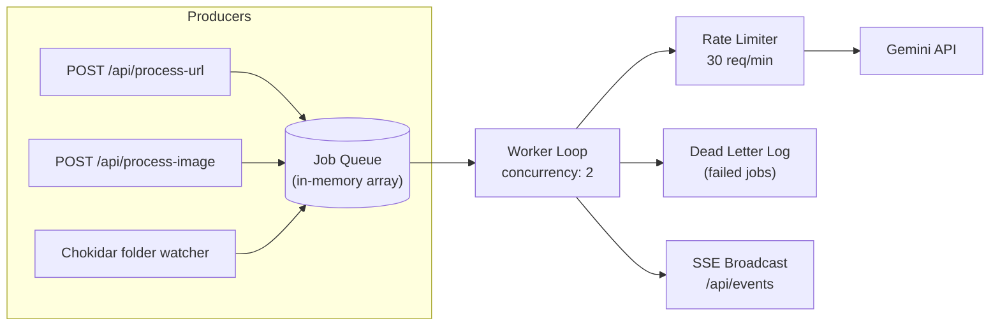
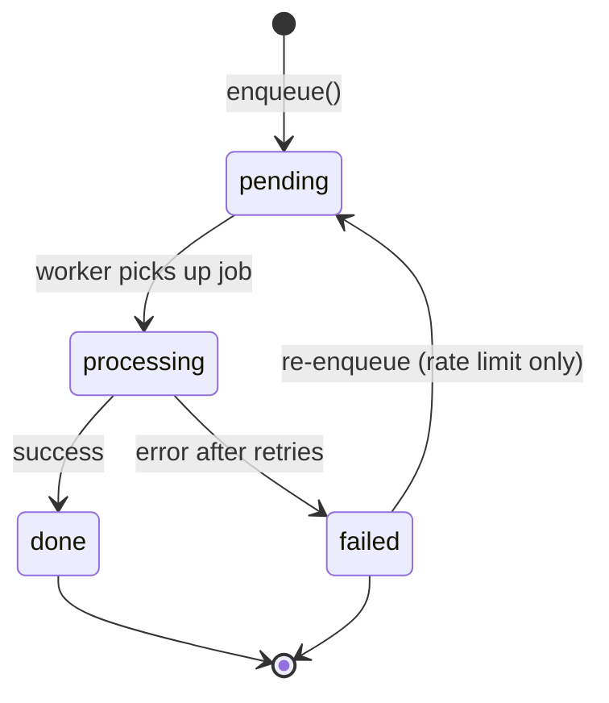

# Queue

In-memory job queue with rate limiting. Every content capture — URL processing, screenshot upload, folder watch event — passes through this queue before hitting Gemini.

The queue exists to solve two problems:
1. **Thundering herd** — 10 screenshots land in a folder at once. Without a queue, all 10 fire Gemini calls simultaneously.
2. **Rate limiting** — Gemini free tier has ~1000 req/day. At 30 req/min max, we stay well under and degrade gracefully.

---

## Architecture



---

## Job Lifecycle



### States

| State | Description |
|-------|-------------|
| `pending` | In the queue, waiting for a worker slot |
| `processing` | Active — downloading, OCR-ing, or calling Gemini |
| `done` | Completed. Note created in Supabase. |
| `failed` | All retries exhausted. Error logged. Possibly a fallback note was created. |

---

## Job Schema

```javascript
{
  id: 'uuid-v4',                    // generated at enqueue time
  type: 'url' | 'image',           // determines which processor to call
  source: 'api' | 'folder_watch',  // who submitted it
  payload: {
    url: 'https://...',             // for type=url
    filePath: '/abs/path/to/img',   // for type=image
    sourceType: 'screenshot' | 'folder',  // for type=image
  },
  state: 'pending' | 'processing' | 'done' | 'failed',
  step: null | 'downloading' | 'extracting' | 'transcribing' | 'categorizing' | 'ocr',
  result: null | Note,              // populated on done
  error: null | string,             // populated on failed
  errorCode: null | string,         // e.g. 'PLATFORM_BLOCKED'
  fallbackUsed: false,              // true if metadata-only fallback produced a note
  fallbackNote: null | Note,        // the fallback note if any
  attempts: 0,                      // increments on each try
  maxAttempts: 2,                   // 1 retry
  createdAt: Date,
  startedAt: null | Date,
  completedAt: null | Date,
}
```

---

## Configuration

```javascript
const QUEUE_CONFIG = {
  maxConcurrency: 2,              // max simultaneous jobs
  maxGeminiPerMinute: 30,         // rate limit
  maxGeminiPerDay: 900,           // leave headroom under 1000
  retryDelayMs: 2000,             // base delay, doubles per attempt
  rateLimitRetryDelayMs: 60_000,  // wait 60s on Gemini 429
  pollIntervalMs: 500,            // worker loop checks queue every 500ms
};
```

### Why These Numbers

- **Concurrency 2**: Two jobs can run in parallel because each job does I/O (yt-dlp download, Gemini API call) not CPU. More than 2 risks hitting Gemini rate limits faster.
- **30/min**: Gemini free tier is ~1000/day. At 30/min sustained, you'd hit 1000 in ~33 min of continuous use. In practice, users send bursts, not sustained streams.
- **900/day**: 10% headroom below 1000 to account for retries and miscounting.

---

## API

### `enqueue(job) → jobId`

```javascript
/**
 * Add a job to the queue.
 * @param {{ type: 'url'|'image', source: 'api'|'folder_watch', payload: object }} job
 * @returns {string} jobId (UUID)
 */
function enqueue({ type, source, payload }) → string
```

- Generates UUID
- Sets state to `pending`
- Broadcasts `job_queued` SSE event
- Returns `jobId` immediately (caller does NOT wait for processing)

### `getStatus(jobId) → Job | null`

```javascript
/**
 * Get the current state of a job.
 * @param {string} jobId
 * @returns {Job|null}
 */
function getStatus(jobId) → Job | null
```

### `getQueueStats() → Stats`

```javascript
/**
 * Get queue statistics.
 * @returns {{ pending, processing, done, failed, dailyApiCalls, rateLimitRemaining, deadLetterCount }}
 */
function getQueueStats() → Stats
```

---

## Rate Limiter

The rate limiter is embedded in the queue worker, not a separate middleware.

```javascript
class RateLimiter {
  constructor(maxPerMinute, maxPerDay) {
    this.maxPerMinute = maxPerMinute;    // 30
    this.maxPerDay = maxPerDay;          // 900
    this.minuteWindow = [];              // timestamps of calls in the last 60s
    this.dayCount = 0;                   // calls today
    this.dayStart = Date.now();          // resets at midnight
  }

  canProceed() {
    this.pruneMinuteWindow();
    this.checkDayReset();
    return this.minuteWindow.length < this.maxPerMinute
        && this.dayCount < this.maxPerDay;
  }

  record() {
    this.minuteWindow.push(Date.now());
    this.dayCount++;
  }

  getWaitMs() {
    // How long until a slot opens in the per-minute window
    if (this.minuteWindow.length < this.maxPerMinute) return 0;
    const oldest = this.minuteWindow[0];
    return Math.max(0, 60_000 - (Date.now() - oldest));
  }

  remaining() {
    this.pruneMinuteWindow();
    return {
      perMinute: this.maxPerMinute - this.minuteWindow.length,
      perDay: this.maxPerDay - this.dayCount,
    };
  }
}
```

### Behavior on Rate Limit Hit

| Scenario | Action |
|----------|--------|
| Per-minute limit reached | Worker pauses for `getWaitMs()` then retries |
| Per-day limit reached | Job fails with `RATE_LIMITED` error. Note created with raw text only (no AI). |
| Gemini returns 429 | Re-enqueue with 60s delay. Not counted as a retry attempt. |

---

## Worker Loop

```javascript
async function workerLoop() {
  while (true) {
    await sleep(QUEUE_CONFIG.pollIntervalMs);

    // Check concurrency
    const activeCount = jobs.filter(j => j.state === 'processing').length;
    if (activeCount >= QUEUE_CONFIG.maxConcurrency) continue;

    // Check rate limit
    if (!rateLimiter.canProceed()) {
      const waitMs = rateLimiter.getWaitMs();
      if (waitMs > 0) await sleep(waitMs);
      continue;
    }

    // Pick next pending job (FIFO)
    const job = jobs.find(j => j.state === 'pending');
    if (!job) continue;

    // Process
    processJob(job);  // fire-and-forget, runs in background
  }
}
```

### processJob(job)

1. Set state → `processing`, broadcast `job_started`
2. Call `processUrl(payload.url)` or `processImage(payload.filePath, payload.sourceType)`
3. On success: state → `done`, broadcast `job_done` with note
4. On error:
   - If `attempts < maxAttempts`: increment, delay, set back to `pending`
   - If Gemini 429: set job state back to pending after 60s delay without incrementing attempts and without broadcasting a new `job_queued` SSE event.
   - Otherwise: state → `failed`, add to dead letter log, broadcast `job_failed`

---

## Dead Letter Log

Failed jobs are kept in an in-memory array (max 100 entries, oldest evicted). Each entry:

```javascript
{
  jobId: 'uuid',
  type: 'url' | 'image',
  payload: { ... },
  error: 'yt-dlp: platform blocked',
  errorCode: 'PLATFORM_BLOCKED',
  failedAt: Date,
  attempts: 2,
  fallbackUsed: true,
  fallbackNote: { id: '...', ... } | null,
}
```

Dead letters are queryable via `getQueueStats()` → `deadLetterCount` and a future `GET /api/queue/dead-letters` endpoint (not implemented in v1, but the data is there).

---

## SSE Integration

The queue owns all SSE broadcasts for job lifecycle events. The folder watcher and API endpoints don't broadcast directly — they enqueue, and the queue broadcasts.

### Events Emitted by Queue

| Event | When | See ARCHITECTURE.md for payload schema |
|-------|------|---------------------------------------|
| `job_queued` | `enqueue()` called | ✓ |
| `job_started` | Worker picks up job / step changes | ✓ |
| `job_done` | Job succeeded, note created | ✓ |
| `job_failed` | Job failed after retries | ✓ |

### Broadcasting

```javascript
function broadcastSSE(event, data) {
  const message = `event: ${event}\ndata: ${JSON.stringify(data)}\n\n`;
  sseClients.forEach(client => {
    try { client.write(message); }
    catch { /* client disconnected, will be pruned */ }
  });
}
```

SSE clients are registered via `GET /api/events`. The `res` object is stored in an array. On `close`, it's removed.

```javascript
app.get('/api/events', (req, res) => {
  res.writeHead(200, {
    'Content-Type': 'text/event-stream',
    'Cache-Control': 'no-cache',
    'Connection': 'keep-alive',
  });
  res.write(`event: connected\ndata: ${JSON.stringify({ serverTime: new Date().toISOString() })}\n\n`);
  addSSEClient(res);
});
```

### Client Reconnection

`EventSource` auto-reconnects with ~3s delay. On reconnect, the client should call `GET /api/queue/stats` to hydrate missed state. There is no event replay — SSE is fire-and-forget.

---

## Persistence

**Decision: in-memory only.** Server restart loses pending jobs. This is acceptable because:
- This is a personal utility tool, not a high-volume multi-tenant service.
- Jobs are short-lived (10-60s each)
- The data source (URL/file) still exists — user can resubmit
- Adding SQLite persistence for the queue adds significant complexity for marginal benefit

If persistence becomes needed later, the job array can be serialized to a `queue` table in Supabase on shutdown and restored on startup.

---

## Memory Management

- **Job history**: Keep last 200 completed/failed jobs in memory. Older ones are evicted.
- **Dead letter log**: Max 100 entries.
- **Active queue**: No hard limit, but in practice limited by user input rate.
- **Estimated memory**: 200 jobs × ~2KB each = ~400KB. Negligible.
